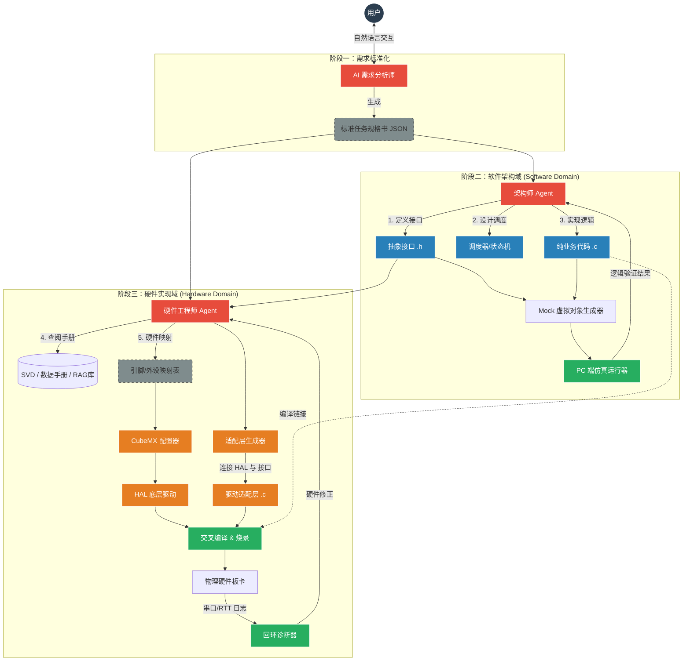
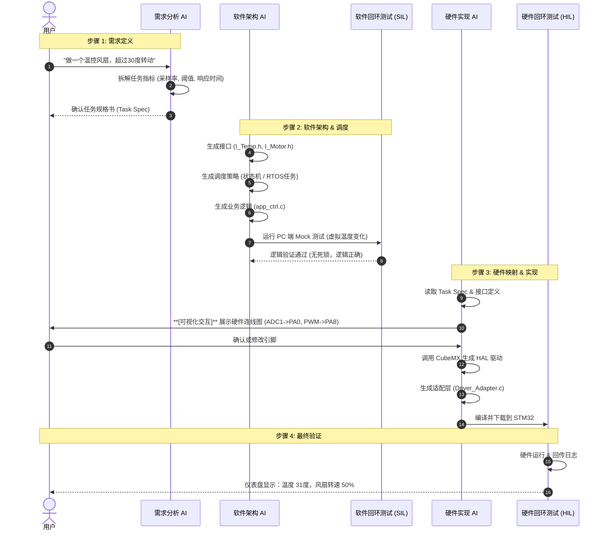

# 🌊 ReifyFlow

[](https://opensource.org/licenses/MIT)
[]()
[]()

> **From Eidos to Matter.**
>
> **从理念到物质。下一代 AI 原生嵌入式开发基础设施。**

ReifyFlow 是一个开源的基础设施项目，旨在打破 **“抽象逻辑 (Idea/Logic)”** 与 **“物理实现 (Reality/Hardware)”** 之间的鸿沟。我们构建了一套 AI 原生 (AI-Native) 的工作流，致力于将自然语言需求自动化转化为高质量的固件代码，实现真正的 **“意图驱动编程” (Intent-Driven Programming)**。

---

## 🚀 Vision (愿景)

在嵌入式开发领域，工程师长期被**碎片化的上下文**所困扰：代码在 IDE 里，硬件配置在 CubeMX 里，寄存器定义在几千页的 PDF 里，而调试日志在串口助手里。

ReifyFlow 通过引入 **AI Agent**、**可视化验证** 和 **双回环测试 (Dual-Loop Testing)**，将这些孤岛连接起来，构建了一个**自我感知、自我纠错、软硬解耦**的自动化开发流水线。

---

## 🏗️ Architecture Overview (架构概览)

ReifyFlow 采用**三层漏斗模型**，确保从需求到落地的每一步都可控、可验证。

### 1. 系统宏观架构 (System Architecture)



---

### 2. 全链路执行流程 (Execution Workflow)

ReifyFlow 强调 **人机交互 (Human-in-the-Loop)**。在关键节点，特别是硬件映射阶段，系统提供可视化界面供用户确认，避免 AI "幻觉" 导致的硬件风险。



---

## 📂 Project Structure (标准化工程结构)

ReifyFlow 生成的项目遵循严格的 **分层解耦** 原则，使得业务逻辑可以脱离硬件独立测试和移植。

```text
Project_Root/
├── .oef/                       # [OEF配置区] - 存放核心元数据，AI 的记忆库
│   ├── task_spec.json          # 1. 任务规格书 (AI生成，唯一事实来源)
│   ├── arch_graph.json         # 2. 软件架构图数据
│   └── hw_map.json             # 3. 硬件映射数据 (引脚分配表)
│
├── core/                       # [软件架构层 - 纯逻辑] - 可以在 PC 上直接跑单元测试
│   ├── inc/
│   │   ├── interface_temp.h    # 抽象接口：只定义 Get_Temp()，绝不包含 HAL 库头文件
│   │   └── interface_motor.h
│   ├── src/
│   │   ├── app_main.c          # 调度器/主循环 (FSM, Scheduler)
│   │   └── business_logic.c    # 核心算法 (PID, 滤波, 状态机)
│   └── tests/                  # SIL 测试代码 (PC端运行，Mock 硬件)
│
├── bsp/                        # [硬件实现层 - 适配器] - 连接软硬的“胶水”
│   ├── stm32f103/              # 具体芯片实现目录
│   │   ├── adapter_temp.c      # 实现 interface_temp.h，内部调用 HAL_ADC
│   │   └── adapter_motor.c     # 实现 interface_motor.h，内部调用 HAL_TIM
│
├── drivers/                    # [底层驱动层 - 自动生成] - CubeMX 的领地，AI 只读不改
│   ├── STM32CubeMX/            # CubeMX 工程目录
│   │   ├── Core/Src/main.c     # 硬件初始化代码
│   │   └── Drivers/            # 厂商提供的 HAL/LL 库文件
│   └── linker/                 # 链接脚本
│
├── tools/                      # [工具链] - 本地自动化脚本
│   ├── build.py                # 自动构建脚本 (调用 GCC/Keil)
│   └── monitor.py              # 日志监控与回环诊断脚本
│
└── Makefile                    # 顶层构建规则
```

---

## 🗺️ Roadmap (路线图)

我们正在分阶段实现这个宏大的愿景：

- [ ] **Phase 1: 核心协议与工具链 (Atomic Tools)**
    - 定义 `reify-protocol` (JSON Schemas)。
    - 实现 `reify-svd-parser` (寄存器映射)。
    - 实现 `reify-rag-engine` (PDF 智能检索)。
- [ ] **Phase 2: 胶水层与生成器 (The Glue)**
    - 实现 `reify-cube-driver` (.ioc 文件操作)。
    - 实现 `reify-code-gen` (基于抽象接口的代码生成)。
- [ ] **Phase 3: 交互与可视化 (The Visualizer)**
    - 开发 Web 可视化工作台，实现代码 <-> 手册的实时跳转。
    - 实现“硬件拓扑图”的拖拽式修改。
- [ ] **Phase 4: 闭环诊断 (Self-Healing)**
    - 集成串口/RTT 日志分析。
    - 实现基于错误日志的自动代码修复。

---

## 🤝 Contributing (贡献)

ReifyFlow 目前处于 **Stealth Mode (隐身开发模式)**，我们正在构建核心 MVP。

如果你对 **嵌入式开发自动化**、**AI Agent** 或 **编译器设计** 感兴趣，欢迎关注我们的进展。

---

*Let's build the compiler for reality.*
