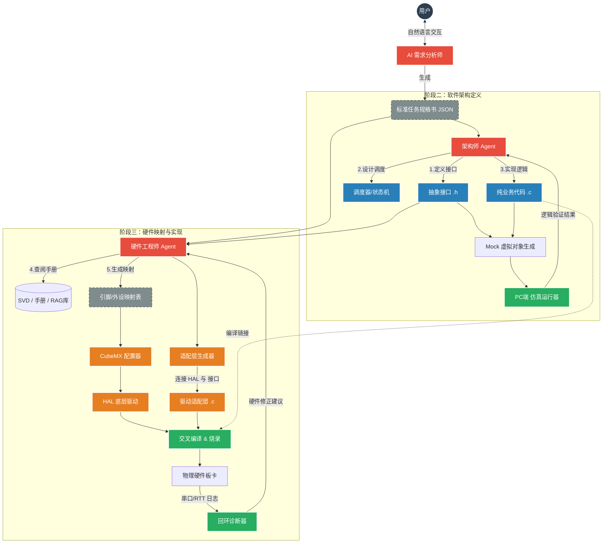

# 🌊 ReifyFlow

<div align="center">
  
  
  <h3>From Eidos to Matter.</h3>
  <p><b>从理念到物质。下一代 AI 原生嵌入式开发基础设施。</b></p>

  [](LICENSE)
  []()
  []()
</div>

---

## 📖 项目简介 (Introduction)

**ReifyFlow** 是一个开源的工程化生态系统，致力于打破 **抽象软件逻辑 (Idea)** 与 **物理硬件实现 (Reality)** 之间的鸿沟。

传统的嵌入式开发中，代码编辑器、硬件配置工具（CubeMX）、数据手册（PDF）和调试工具是割裂的孤岛。ReifyFlow 通过 **AI Agent**、**标准化协议** 和 **双回环验证**，构建了一套 **AI Native** 的自动化流水线：

1.  **意图驱动**：用自然语言描述需求，AI 自动拆解任务。
2.  **软硬解耦**：业务逻辑与底层驱动物理隔离，支持在 PC 端进行纯软件仿真。
3.  **交互验证**：在生成代码前，通过可视化拓扑图确认硬件连接，拒绝黑盒操作。
4.  **自愈闭环**：通过硬件回环日志，自动诊断故障并修正底层配置。

---

## 🏗️ 系统架构 (System Architecture)

ReifyFlow 采用 **三段式漏斗模型**，将开发流程划分为三个独立的阶段。下图展示了数据如何在软件域与硬件域之间流转。



---

## 🔄 全链路执行流程 (Execution Workflow)

这是一个 **人机协作 (Human-in-the-Loop)** 的过程。AI 负责繁琐的生成工作，人类负责关键节点的决策与确认。


---

## 🧩 仓库矩阵 (Repository Matrix)

ReifyFlow 采用微服务化的 **Multi-Repo** 架构，各模块职责分明：

| 仓库名称 | 核心职责 | 技术栈 |
| :--- | :--- | :--- |
| **[`reify-protocol`](https://github.com/ReifyFlow/reify-protocol)** | 定义所有组件交互的数据标准（软件定义、硬件映射、日志格式）。**所有开发由此开始。** | JSON Schema |
| **[`reify-core`](https://github.com/ReifyFlow/reify-core)** | 核心编排引擎。集成 LLM、SVD 解析器、PDF 检索引擎、日志分析器。 | Python (FastAPI) |
| **[`reify-driver`](https://github.com/ReifyFlow/reify-driver)** | 通用硬件适配器。屏蔽厂商差异，操作 CubeMX/CMake，调用编译器与下载器。 | Python CLI |
| **[`reify-studio`](https://github.com/ReifyFlow/reify-studio)** | 可视化交互工作台 (VS Code 插件)。提供硬件拓扑图绘制、手册联动阅读。 | TS / React |
| **[`reify-chips`](https://github.com/ReifyFlow/reify-chips)** | 芯片知识库。存放 SVD 寄存器定义、Datasheet 索引映射、代码模板。 | Data |

---

## 📂 标准化工程结构 (Project Structure)

ReifyFlow 生成的工程遵循严格的 **分层解耦** 原则：

```text
Project_Root/
├── .oef/                       # [OEF配置区] - 存放核心元数据
│   ├── task_spec.json          # 1. 任务规格书 (AI生成)
│   ├── arch_graph.json         # 2. 软件架构图数据
│   └── hw_map.json             # 3. 硬件映射数据
│
├── core/                       # [软件架构层 - 纯逻辑] - 可以在电脑上跑
│   ├── inc/
│   │   ├── interface_temp.h    # 抽象接口：只定义 Get_Temp()，不含 HAL 库
│   │   └── interface_motor.h
│   ├── src/
│   │   ├── app_main.c          # 调度器/主循环
│   │   └── business_logic.c    # 核心算法 (PID, 状态机)
│   └── tests/                  # SIL 测试代码 (PC端运行)
│
├── bsp/                        # [硬件实现层 - 适配器] - 连接软硬的胶水
│   ├── stm32f103/              # 具体芯片实现
│   │   ├── adapter_temp.c      # 实现 interface_temp.h，调用 HAL_ADC
│   │   └── adapter_motor.c     # 实现 interface_motor.h，调用 HAL_TIM
│
├── drivers/                    # [底层驱动层 - 自动生成] - CubeMX 的地盘
│   ├── STM32CubeMX/            # CubeMX 工程目录
│   │   ├── Core/Src/main.c     # 硬件初始化
│   │   └── Drivers/            # HAL 库文件
│   └── linker/                 # 链接脚本
│
├── tools/                      # [工具链]
│   ├── build.py                # 自动构建脚本
│   └── monitor.py              # 日志监控脚本
│
└── Makefile                    # 顶层构建规则
```

## 🔄 The Workflow (标准工作流)

我们定义了 **T-V-E-L** 标准流程，确保每一步都可控：

1. **Translate (翻译)** : AI 将自然语言需求转化为 **Task Spec** (JSON)。
2. **Verify (验证)** : `reify-studio` 渲染出硬件连线图，用户进行**可视化确认**。
3. **Execute (执行)** : `reify-driver` 修改底层配置，生成代码并烧录。
4. **Loopback (回环)** : 硬件日志回传，AI 进行故障诊断。

---

## 🗺️ MVP Roadmap (当前计划)

目前项目处于 **MVP 开发阶段**，主要聚焦于 STM32F103 的点灯与串口通信闭环。

- [ ] **Step 1**: 完成 `reify-protocol` 协议定义。
- [ ] **Step 2**: 实现 `reify-driver` 对 STM32CubeMX `.ioc` 文件的读写。
- [ ] **Step 3**: 跑通 "自然语言 -> 代码生成 -> 硬件运行" 的单向链路。
- [ ] **Step 4**: 开发 VS Code 插件可视化界面。

---

## 🤝 Join Us

ReifyFlow 是一个开放的实验。如果你对 **AI Agent**、**嵌入式开发自动化** 或 **编译器设计** 感兴趣，欢迎 Star 或提交 PR。

*License: AGPL-3.0 (Core/Driver) & MIT (Protocol/UI)*
